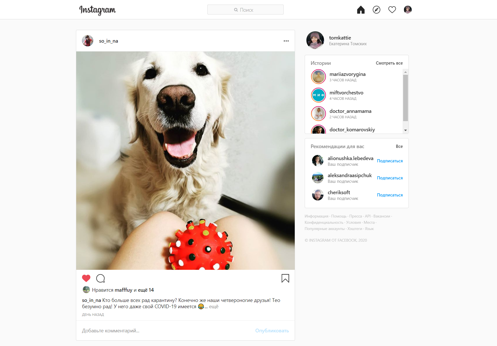

# Сценарий для автоматизации
В предыдущем задании я разбила критичный функционал на несколько сценариев, которые включают в себя набор атомарных тесткейсов.
Рассмотрим один из них - **просмотр контента**. 
Почему он самый критичный:
* Сама суть сервиса - обмен контентом, за этим пользователи и приходят.
* Instagram и бизнес-аккаунты зарабатывают на просмотрах.
* Потеря лояльности при неработоспособности этого функционала будут максимальна.
Рассматривать будем браузерную версию в Google Chrome.

## Структура проекта
В main/java лежат сами PajeObject - классы, описвающие страницы. Их у меня два:
1. LoginPage - страница авторизации
2. MainPage - главная страница сервиса, отображаемая авторизованному пользователю. Т.к. она достаточно сложная, в подклассы лучше вынести функциональные блоки. У меня для примера создан подкласс Article, описывающий публикации в ленте. 

В test/java лежат сами тесты
1. LoginTest - тестроване авторизации (на этом училась, оставила). 
Тесткейсы:
* Авторизация по логину-паролю с некорректными данными: должна отобразиться ошибка (проверяю толкьо наличие, без текста).
* Авторизация по логину-паролю с корректными данными: не должна отображаться ошибка, должен выполниться переход на https://www.instagram.com/
2. ViewContentTest - тестирование просмотра контента
Тесткейсы:

# Тесткейсы
До запуска тесткейсов необходимо, чтобы пользователь авторизовался
* Проверка наличия необходимых блоков на странице - в такой реализации считаю избыточным. Он бы пригодился, если задан порядок выполнения тестов, т.к. выполняется быстрее других и сразу покажет, если есть ошибка, из-за которой целая ветка тестов, относящаяся к конкретному блоку, может слететь.
* Проверка, что есть публикации и они подгружаются при скрелле страницы
* Проверка корректности перехода в профиль автора публикации

MainPage считаем эту:

